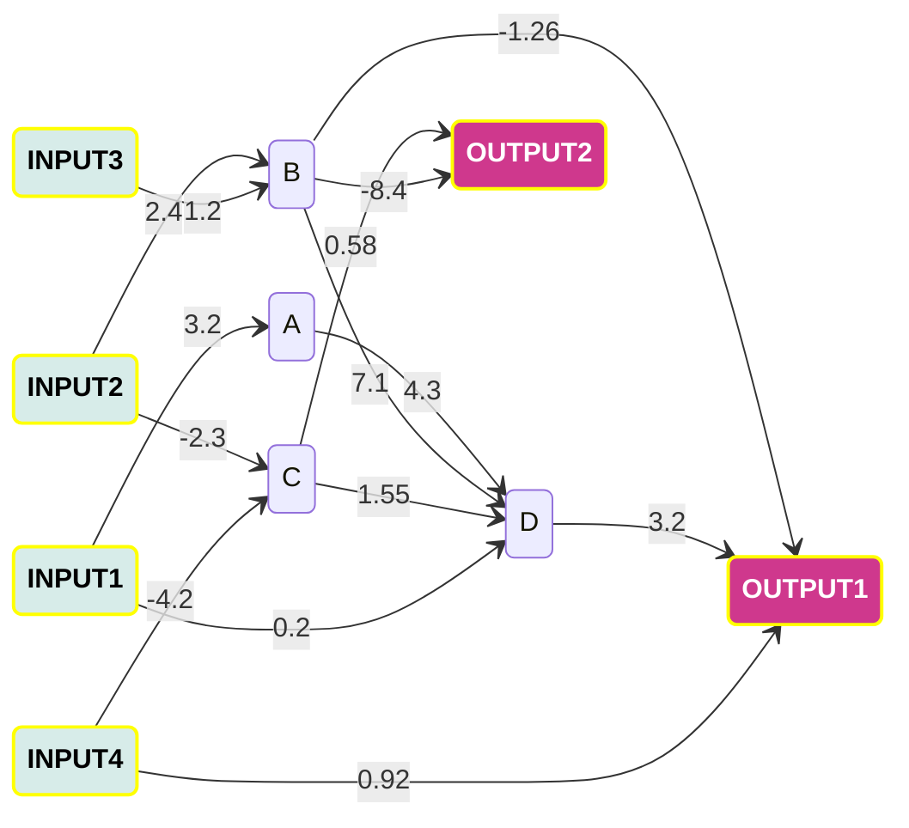
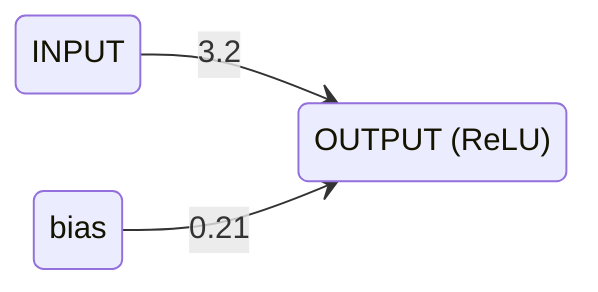

# mmnn - Micro Managed Neural Network
bash-cli for Neural Network propagation/backpropagation

# Table of Contents

1. [Introduction](#introduction)
2. [Getting Started](#getting-started)
   - [Installation](#installation)
   - [Features](#features)
   - [Basic Usage](#basic-usage)
      - [Propagate](#propagation)
      - [Learn](#learning)
   - [Advanced Usage](#advanced-usage)
3. [Examples](#examples)

## Introduction

A **bash-cli** Micro Managed Neural Network. Write your neural network configuration in JSON format and use this tool to run it.

**mmnn** takes input values from the stdin and outputs them to stdout so you can design your scripts to pipe the neuron input/output values to/from it.

The idea behind **mmnn** is that most of the frameworks for Neural Networks are connecting huge layers which makes it hard to analyze individual neurons connections. Additionally, direct neuron connections are only possible between consecutively connected layers. I wanted to change this and this is the result.

Take, for example, the following neural network, which is possible to propagate and train with **mmnn**.



## Getting Started

### Installation

<table>
<tr> <td> Build Manually </td>
</tr>
<tr>
<td>

```bash
$ git clone git:github.com/GrgoMariani/mmnn
$ cd mmnn
$ cargo run --help
```

</td>
</tr>
</table>

### Features

* Network configuration in JSON
* Forward propagation
* Backward propagation
* Recursive connections between neurons possible (more on that later)

### Basic Usage

#### Propagate

Take this network for example:



This network consists of only one input neuron, one output neuron and a bias.

The equivalent configuration mmnn would use for this would be:

```json
{
    "inputs": ["INPUT"],
    "outputs": ["OUTPUT"],
    "neurons": {
        "OUTPUT": {
            "bias": 0.21,
            "activation": "ReLU",
            "synapses": {
                "INPUT": 3.2
            }
        }
    }
}
```

> INFO: Notice how the synapses are defined right-to-left. i.e. previous neuron results are arguments for the next neuron.

If we save this configuration as **config.json** we could propagate it like so:
```bash
$ mmnn propagate config.json
> 1
> 3.41
> 2
> 6.61
```

The propagation is done through the standard input where each line represents input values to the neurons.

#### Learn

Learning is done similar to propagation

```bash
$ mmnn learn config.json saved_config.json --learning-rate 0.5
```

Note that each odd input line is propagation step while the propagation step is each even one. Learned configuration is saved once all stdin lines are read or when SIGTERM is caught.

The output is also somewhat different as it shows the neuron names and calculated error output.


### Advanced Usage

Here is a simple [Flip Flop](https://en.wikipedia.org/wiki/Flip-flop_(electronics))-like neural network which makes use of recursive neuron connections.
```bash
$ mmnn propagate <(cat <<-EOL
    {
        "inputs": ["i1", "i2"],
        "outputs": ["Q", "!Q"],
        "neurons": {
            "Q": {
                "bias": 1,
                "activation": "ReLU",
                "synapses": {
                    "!Q": -1,
                    "i1": -1
                }
            },
            "!Q": {
                "bias": 1,
                "activation": "ReLU",
                "synapses": {
                    "Q": -1,
                    "i2": -1
                }
            }
        }
    }
EOL
)
```

Playing around with the input values should showcase how memory is retained.

## Examples

By design this cargo package is a bash command line interface so bash can be utilized in full to create your propagation/training data.

For example:

```bash
#!/bin/bash

function create_training_data() {
    local iterations="${1}"
    local i1 i2 AND OR NOR
    for ((i=0; i<iterations; i++)); do
        i1=$((RANDOM%2))
        i2=$((RANDOM%2))
        AND=$((i1 & i2))
        OR=$((i1 | i2))
        NOR=$((!i1 & !i2))
        # odd lines for forward propagation
        echo "${i1} ${i2}"
        # even lines for backpropagation
        echo "${AND} ${OR} ${NOR}"
    done
}

TRAIN_DATA_FILE=$(mktemp)

echo "Creating the training data"
create_training_data 200000 > "${TRAIN_DATA_FILE}"

# train the model
echo "Training the model"
cat "${TRAIN_DATA_FILE}" | mmnn learn <(cat <<-EOL
    {
        "inputs": ["i1", "i2"],
        "outputs": ["AND", "OR", "NOR"],
        "neurons": {
            "AND": {
                "bias": 0.5,
                "activation": "relu",
                "synapses": {
                    "i1": 1,
                    "i2": 3
                }
            },
            "OR": {
                "bias": 2,
                "activation": "relu",
                "synapses": {
                    "i1": 3.2,
                    "i2": -1
                }
            },
            "NOR": {
                "bias": 1,
                "activation": "relu",
                "synapses": {
                    "i1": 2.2,
                    "i2": -1.1
                }
            }
        }
    }
EOL
) config_save.json --learning-rate 0.05
echo "Learning done!"
# try the saved model
mmnn propagate config_save.json
```