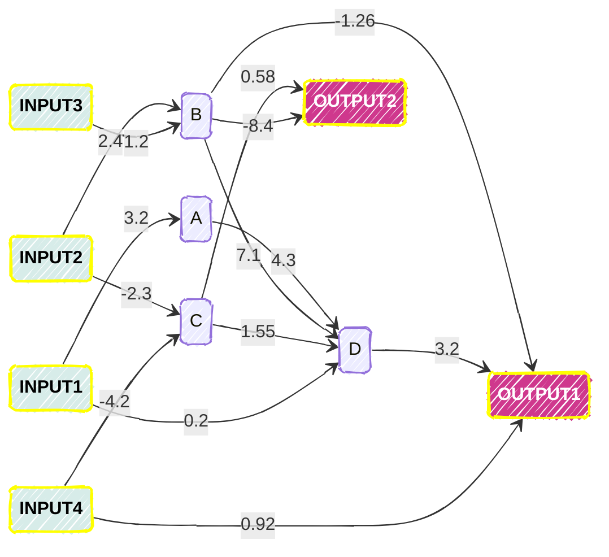
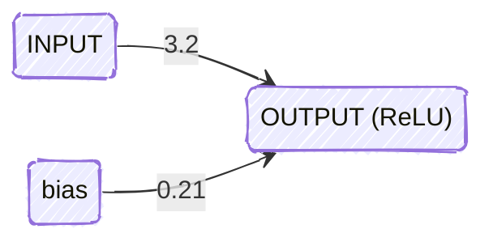
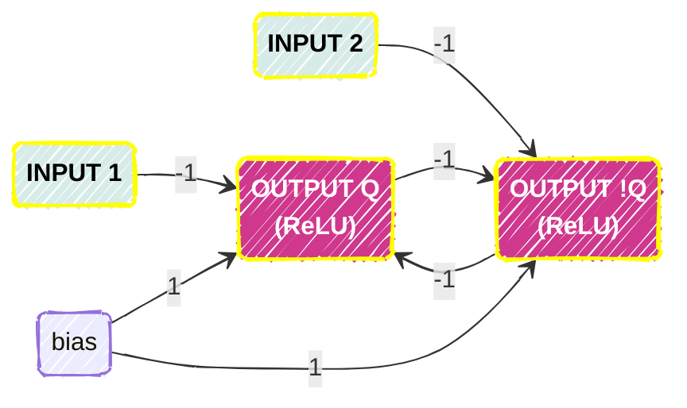

# mmnn - Micro Managed Neural Network

[](https://crates.io/crates/mmnn)
[](LICENSE)
[](https://www.rust-lang.org)

A minimalist, flexible Neural Network CLI tool written in Rust that gives you precise control over neuron connections.

# Table of Contents

1. [Introduction](#introduction) 
2. [Getting Started](#getting-started)
   - [Prerequisites](#prerequisites)
   - [Installation](#installation)
3. [Features](#features)
4. [Usage](#usage)
   - [Basic Usage](#basic-usage)
   - [Advanced Usage](#advanced-usage)
5. [Examples](#examples)
6. [Contributing](#contributing)
7. [License](#license)

## Introduction

**mmnn** (Micro Managed Neural Network) is a command-line tool that lets you design and experiment with neural networks using a simple JSON configuration format. Key benefits include:

- Fine-grained control over individual neuron connections
- Support for recursive neural networks
- Easy integration with shell scripts via stdin/stdout
- Minimal dependencies and lightweight design

Take, for example, the following neural network, which is possible to be defined, propagated and trained with **mmnn**.



## Getting Started

### Prerequisites

Before you begin, ensure you have met the following requirements:

- Rust 1.70 or later
- Cargo package manager
- Basic understanding of neural networks
- (Optional) Basic shell scripting knowledge

### Installation

You can choose between two options:

<table>
<tr> <td> <b>Install cargo</b> </td>
<td> <b>Build Manually</b> </td>
</tr>
<tr>
<td>

```bash
$ cargo install mmnn
$ mmnn --help
```

</td>
<td>

```bash
$ git clone git@github.com:GrgoMariani/mmnnrust
$ cd mmnnrust
$ cargo run -- --help
```

</td>
</tr>
</table>

## Features

* JSON configuration
* Forward propagation
* Backward propagation
* Recursive connections between neurons possible (more on that later)
* Activations
  * ArcTan
  * Binary
  * ISRU
  * LeakyReLU
  * Linear
  * ReLU
  * ELU
  * GELU
  * Gaussian
  * SoftSign
  * SoftStep/Sigmoid
  * TanH
  * Swish

## Usage

### Basic Usage

Take this network for example:



This network consists of only one input neuron, one output neuron and a bias.

The equivalent configuration mmnn would use for this would be:

```json
{
    "inputs": ["INPUT"],
    "outputs": ["OUTPUT"],
    "neurons": {
        "OUTPUT": {
            "bias": 0.21,
            "activation": "ReLU",
            "synapses": {
                "INPUT": 3.2
            }
        }
    }
}
```

> INFO: Notice how the synapses are defined right-to-left. i.e. previous neuron results are arguments for the next neuron.

If we save this configuration as **config.json** we could propagate it like so:
```bash
$ mmnn propagate config.json
stdin  > 1
stdout > 3.41
stdin  > 2
stdout > 6.61
```

The propagation is done through the standard input where each line represents input values to the neurons.

Read the rest of this README for more configuration examples.

### Advanced Usage

Here is a simple [Flip Flop](https://en.wikipedia.org/wiki/Flip-flop_(electronics))-like neural network which makes use of recursive neuron connections.


```bash
$ mmnn propagate <(cat <<-EOL
    {
        "inputs": ["i1", "i2"],
        "outputs": ["Q", "!Q"],
        "neurons": {
            "Q": {
                "bias": 1,
                "activation": "ReLU",
                "synapses": {
                    "!Q": -1,
                    "i1": -1
                }
            },
            "!Q": {
                "bias": 1,
                "activation": "ReLU",
                "synapses": {
                    "Q": -1,
                    "i2": -1
                }
            }
        }
    }
EOL
)
```

Playing around with the input values should showcase how memory value of this circuit/network is retained.

## Examples

By design this cargo package is a bash command line interface so bash can be utilized in full to create your propagation/training data.

For example:

```bash
#!/bin/bash

function create_training_data() {
    local iterations="${1}"
    local i1 i2 AND OR NOR
    for ((i=0; i<iterations; i++)); do
        i1=$((RANDOM%2))
        i2=$((RANDOM%2))
        AND=$((i1 & i2))
        OR=$((i1 | i2))
        NOR=$((!i1 & !i2))
        # odd lines for forward propagation
        echo "${i1} ${i2}"
        # even lines for backpropagation
        echo "${AND} ${OR} ${NOR}"
    done
}

TRAIN_DATA_FILE=$(mktemp)

echo "Creating the training data"
create_training_data 200000 > "${TRAIN_DATA_FILE}"

# train the model
echo "Training the model"
cat "${TRAIN_DATA_FILE}" | mmnn learn <(cat <<-EOL
    {
        "inputs": ["i1", "i2"],
        "outputs": ["AND", "OR", "NOR"],
        "neurons": {
            "AND": {
                "bias": 0.5,
                "activation": "relu",
                "synapses": {
                    "i1": 1,
                    "i2": 3
                }
            },
            "OR": {
                "bias": 2,
                "activation": "relu",
                "synapses": {
                    "i1": 3.2,
                    "i2": -1
                }
            },
            "NOR": {
                "bias": 1,
                "activation": "relu",
                "synapses": {
                    "i1": 2.2,
                    "i2": -1.1
                }
            }
        }
    }
EOL
) config_save.json --learning-rate 0.05
echo "Learning done!"
# try the saved model
mmnn propagate config_save.json
```

## Contributing

Contributions are welcome! Please feel free to submit a Pull Request. For major changes, please open an issue first to discuss what you would like to change.

Please make sure to update tests as appropriate.

## License

Licensed under either of:

- Apache License, Version 2.0 ([LICENSE-APACHE](LICENSE-APACHE) or http://www.apache.org/licenses/LICENSE-2.0)
- MIT license ([LICENSE-MIT](LICENSE-MIT) or http://opensource.org/licenses/MIT)

at your option.

### Contribution

Unless you explicitly state otherwise, any contribution intentionally submitted for inclusion in the work by you shall be dual licensed as above, without any additional terms or conditions.

Have fun playing around with this tool!
